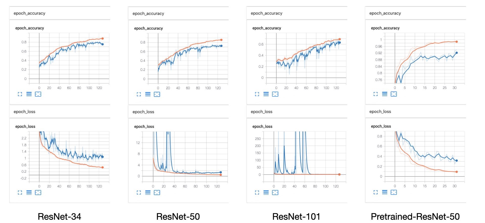
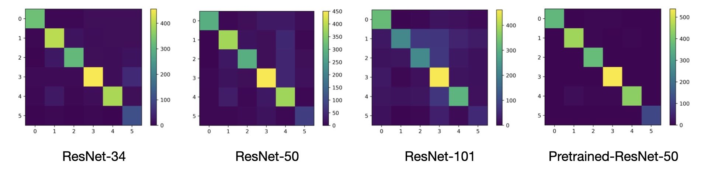

# 基于深度学习的垃圾图像分类模型

## 摘要

在本项目中，我们复现了 ResNet 结构，并使用此结构进行垃圾图片的分类任务。我们分别从头训练了 ResNet-34，ResNet-50 以及 ResNet 101，并额外训练了一个使用 ImageNet 预训练权重的 ResNet-50。经过测试，我们的模型在交叉验证集上的最优准确率可以达到 90% 以上。

## 模型架构

在 ResNet 结构出现之前，研究者们已经发现更深的卷积神经网络架构能够让模型具有更高的准确度。然而，更进一步的实验结果表明，随着神经网络深度的继续增加，模型的具体表现在达到一个阈值之后不升反降。因此，ResNet 的作者提出了将模型中低层的特征直接传到高层，从而帮助更深层的卷积层获得多的包含图像的信息。实验证明，ResNet 的结构是极其成功的，它的出现使训练更深的神经网络模型，并在更深的神经网络模型上取得更为优秀的准确度成为可能，对机器视觉领域产生了深远的影响。在本项目中，我们根据 ResNet 原始论文 Deep Residual Learning for Image Recognition，复现了论文中提到的 ResNet-34，ResNet-50 以及 ResNet-101，并额外使用 Keras 提供的在 ImageNet 上预训练过的 ResNet-50 作为特征提取部分训练了一个多层感知器模型。

### 残差块

残差块是 ResNet 采取的创新的核心部分。对于传统的卷积神经网络来说，其特征提取部分通常是通过多个卷积层的直接堆叠产生的，若使用 $\mathcal{F}$ 表示单个 building block 学习到的映射，$W$ 表示单个 building block 的参数，则传统的卷积神经网络的单个 building block 有如下数学表示。
$$
y = \mathcal{F}(x, \{W_i\})
$$
而 ResNet 的 building block 将其输入作为另一个特征，直接以恒等映射的方式加在卷积层的输出之后，其数学表示如下。
$$
y = \mathcal{F}(x, \{W_i\}) + x
$$
若由于卷积层的步长等原因导致输入的特征 $x$ 与卷积层输出的特征 $\mathcal{F}(x, \{W_i\})$ 形状不符，作者提出了两种解决的方式：（1）依然使用恒等映射，使用 0 填充形状不符的部分（2）使用一个额外的 1x1 卷基层来处理输入，从而使其与卷积层的输出形状相符。结合 Keras 中对 ResNet 的实现，我们决定选取方法（2），也就是在形状不符时使用如下方法构建 building block。
$$
y = \mathcal{F}(x, \{W_i\}) + W_s x
$$
对于经典的 3x3 残差块，卷积层的部分我们使用了 3x3 卷积 - 批归一化 - relu 激活函数 - 3x3 卷积 - 批归一化 - 按位加 - relu 激活函数的构成。具体的实现代码参见 `utils._residual_block`。

### Bottleneck 结构

之前提到的残差块已经可以用来构建层数适中的 ResNet 结构。但是，如果层数继续加深，此结构的参数数量会大幅增加，从而使神经网络训练过于缓慢。因此，ResNet 的作者对从 ResNet-50 开始的 ResNet 结构使用了 Bottleneck 结构来替换之前提到的残差块。具体而言，在 bottleneck 结构中作者使用了 1x1 - 3x3 - 1x1 的卷积层配置替换之前的 3x3 - 3x3 卷积层配置，从而减少了参数数量。

### 网络结构

我们将我们使用的从头训练的三种 ResNet 结构以及加载预训练权重的 ResNet 结构列在下表。列表中 f 表示 filters，s 表示 strides。rb(a) 表示 filters 数量为 a 的 residual block，bb(a, b) 表示 filters 数量为 a，a，b 的 bottlenect block。

|      Resnet-34      |      ResNet-50      |     ResNet-101      | Pretrained-ResNet-50 |
| :-----------------: | :-----------------: | :-----------------: | :------------------: |
| 7x7 conv, f 64, s 2 | 7x7 conv, f 64, s 2 | 7x7 conv, f 64, s 2 | 7x7 conv, f 64, s 2  |
|  3x3 max pool, s 2  |  3x3 max pool, s 2  |  3x3 max pool, s 2  |  3x3 max pool, s 2   |
|     rb(64) x 3      |   bb(64, 256) x 3   |   bb(64, 256) x 3   |   bb(64, 256) x 3    |
|     rb(128) x 3     |  bb(128, 512) x 4   |  bb(128, 512) x 4   |   bb(128, 512) x 4   |
|     rb(256) x 6     |  bb(256, 1024) x 6  | bb(256, 1024) x 23  |  bb(256, 1024) x 6   |
|     rb(512) x 3     |  bb(512, 2048) x 3  |  bb(512, 2048) x 3  |  bb(512, 2048) x 3   |
|      avg pool       |      avg pool       |      avg pool       |       avg pool       |
|          -          |          -          |          -          |   2048 dense, relu   |
|  6 dense, softmax   |  6 dense, softmax   |  6 dense, softmax   |   6 dense, softmax   |

对于 Pretrained-ResNet-50 来说，除了其最后两个全连接层外，剩余层的权重在训练中均冻结。

## 模型训练

在训练中，我们使用了 categorical cross entropy 作为模型的损失函数。对于从头训练的 ResNet-34，ResNet-50 以及 ResNet-101 来说，我们使用了初始学习率为 $10^{-3}$ 的 Adam 优化器，每 32 个 epoch 将学习率减半，共训练 128 个 epoch；对于预训练过的 Pretrained-ResNet-50 来说，我们使用了初始学习率为 $10^{-3}$ 的 Adam 优化器，每 8 个 epoch 将学习率减半，共训练 32 个 epoch。

我们使用了 Keras 提供的 `ImageDataGenerator` 和 imgaug 库进行数据增强，具体的增强方式包括旋转、水平偏移、竖直偏移、放缩、水平翻转、竖直翻转、高斯噪声、像素数值偏移。对于从头训练的模型，我们还使用了 featurewise center 和 featurewise std normalization（我们抽样了数据集的一些图片来计算此操作需要的均值和标准差）。同时我们使用了 10% 的数据作为交叉验证数据。我们使用了 Keras 的 `TensorBoard` 回调记录训练日志，相应的损失函数曲线和准确率曲线如下所示。

## 模型测试

在测试中，我们使用了全部、未经数据增强的原始数据，比较了数据的真实标签与模型的预测值。我们计算了所有模型的 contingency table，并将其可视化如下。在 contingency table 中，行表示样本的真实标签，列表示样本被预测的标签。

根据 contingency table，我们计算了模型对于每个类别分类的精确率（prevision）、召回率（recall）、F1 指标。相应结果见下表。每个单元格中的数值分别表示精确率 - 召回率 - F1 指标。

|           |     Resnet-34      |     ResNet-50      |     ResNet-101     | Pretrained-ResNet-50 |
| :-------: | :----------------: | :----------------: | :----------------: | :------------------: |
| cardboard | 0.95 - 0.88 - 0.91 | 0.96 - 0.78 - 0.86 | 0.75 - 0.87 - 0.80 |  0.99 - 0.98 - 0.99  |
|   glass   | 0.86 - 0.88 - 0.87 | 0.82 - 0.82 - 0.82 | 0.84 - 0.48 - 0.61 |  0.97 - 0.98 - 0.97  |
|   metal   | 0.90 - 0.82 - 0.86 | 0.85 - 0.76 - 0.80 | 0.66 - 0.58 - 0.62 |  0.97 - 0.99 - 0.98  |
|   paper   | 0.91 - 0.84 - 0.87 | 0.83 - 0.83 - 0.83 | 0.63 - 0.85 - 0.72 |  0.98 - 0.99 - 0.99  |
|  plastic  | 0.90 - 0.87 - 0.89 | 0.69 - 0.84 - 0.76 | 0.74 - 0.68 - 0.71 |  0.99 - 0.95 - 0.97  |
|   trash   | 0.51 - 0.96 - 0.67 | 0.66 - 0.73 - 0.69 | 0.38 - 0.45 - 0.41 |  0.97 - 1.0 - 0.98   |

从表格中可以发现，Pretrained-ResNet-50 的在各个分类上的准确度指标远高于其他模型。因此，在本项目的提交版本中，我们选用了 Pretrained-ResNet-50。

## 结论与见解

从我们的测试结果以及在 Mo 平台的测试数据来看，我们的模型在总体上取得了较为优秀的性能表现。同时，在模型的训练过程中我们也总结出了一些经验以及可能提高模型的方法。

从结果来看，经过预训练的模型表现远高于其他模型是可以理解的，但是对于同样从头训练的模型，网络的深度越深反而结果越差。我们认为这可能是由于我们对模型的训练时长不够，以及采纳的学习率衰减方法不合理导致的，从 TensorBoard 给出的准确度和损失曲线也可以看出来这一点：对于从头训练的模型，尤其是 ResNet-101，在训练结束时其在交叉验证集上的准确度仍然具有上升趋势，因此我们基本可以确定更长时间的训练会带来更好的模型表现，而受时间限制，我们目前还无法确定从头训练的这些模型性能表现的极限在哪里。

Pretrained-ResNet-50 虽然取得了较为优秀的结果，但从曲线来看此模型也存在一些过拟合问题。在我们的实现中我们对倒数第二个全连接层增加了 L2 正则化来对抗过拟合问题，但看起来这并不够。在之后的工作中可以尝试增加 dropout layer，以及使用更为 aggressive 的数据增强方法来对抗过拟合问题（另外一个问题是，由于 Pretrained-ResNet-50 的输入没有 featurewise center 和 featurewise std normalization，我们统一添加的阈值为 0.1 的颜色偏移对于区间为 0-255 的图片来说太小）。

本项目的一个问题是在模型训练中并没有预留测试集，而是仅使用了 Keras 的 `ImageDataGenerator` 提供的交叉验证集。由于此交叉验证集每一次运行都具有不同的初始化，因此本报告中只能够提供模型在整个训练数据集上的测试数据，而无法对比模型在训练数据和测试数据上各自的性能表现。

