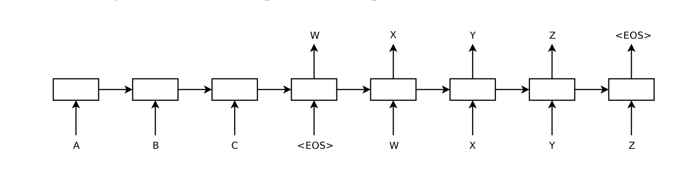
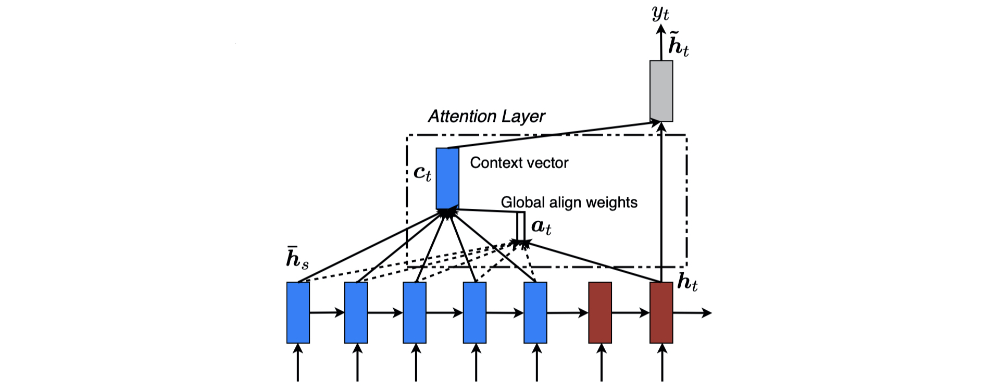

# 循环神经网络与音乐情感连续预测

情感是造物者对于生命的独特的馈赠。人类能够感知物体，感受世界的变化，但正是这些东西唤起了我们独特情感使得我们人类能够有别于装配了摄像头和麦克风的机械。在现实世界中，多媒体信息，例如文字，音乐，图像，气味，都能够唤起人的特定情感反应，而当这些信息混合在一起呈现给人类时，他们各自所唤起的情感又会相互混合，形成更为复杂的情感特征。而音乐作为能够传递情感的信息，在很多时候用来创造一种特定的情感氛围，例如游戏或电影中配乐的使用或是派对上的背景音乐。在本文章中，我们使用融合了注意力机制的 seq2seq 模型，在 valence-arousal 情感空间进行对给定的音乐片段的情感表达进行连续预测。文中的测试表明，我们的模型相对于基于多层感知器的基线模型取得了较为显著的预测准确性提升。

## 背景及研究方法

与图像分类、自然语言识别等研究较为充分、在较多应用场景下取得 state of art 成果的方向不同，音乐情感识别方面的研究在一些基础的问题上，例如对情感的量化、对音频特征的提取、以及模型的构建方法上仍然没有业界通用的标准。在本部分中，我们将对这些基础的问题进行回顾与讨论，并提出本项目在这些问题中采取的解决方法。

### 情感量化

根据相关领域的综述文献，在音乐情感识别领域应用的情感量化方式主要包括分类模型以及维度模型[^1]。前者通过分类的方式将情感划分为不同的类别标签，并据此将音乐情感识别作为一个分类问题。具体的分类方式包括将情感划分为一组最基础的类别，而将其他的情感视为这些基础情感类别的组合[^2]，或者将情感分类为更为细致的类别再进行聚类[^3]。分类模型所获得的情感类别对用户来说是易于理解的，但通常来说，研究者并无法保证这些类别之间是不相关的，同时，数量过多并且相互间存在相关性的类别在数据标注中对于标注者是一个很大的挑战。与此相对的，维度模型通过选取不同基，将不同的情感表示为由这些基组成的线性空间内的向量，从而将音乐情感识别作为一个回归问题。 valence-arousal [^4]（将情感分为愉悦度与唤醒度） 以及 valence-arousal-potency[^5]（将情感氛围愉悦度、唤醒度以及效用度） 都是典型的维度情感空间表示。维度模型理论上能够表示无限多种情感，并可以通过一定的映射方式将分类模型中的类别也映射为维度模型中的向量。但与分类模型相似，维度模型通常也无法保证不同基之间的不相关性，因此在一些研究中，研究者会对维度模型根据实验数据再进行一些变换以保证基之间的正交性。

本文旨在对音乐片段进行连续的情感预测，考虑到数据标注的简易性所带来的数据及大小差异（在使用维度模型事用户可以使用鼠标在固定区域内滑动来进行实时数据标注，而分类模型需要逐一点击类别，操作较慢）以及情感空间的简洁性，本文决定使用 valence-arousal 作为情感模型，从而将音乐情感识别作为一个回归问题。

### 音频特征提取

通常来说，人们使用声音波形文件（wav）来存储音频，而在大多数情况下声音波形并不会被直接作为模型的输入数据，而是要通过对波形的处理获得不同的特征，再将这些特征输入模型，其中对音乐代表的情感相关性较强的特征包括谱中位数、响度、尖锐度等[^6]。除波形文件之外，电子乐谱文件（midi），以及音频的元数据，包括乐曲名称、歌手、流派、年代、歌词等信息也曾被用于音乐情感识别中。

鉴于当前消费者所见到的大多数音乐均以声音波形文件的方式呈现，同时，由于获得与音频匹配的元数据较为困难，且这些数据也在一定程度上通过融入文本分析的方式弱化了音乐情感识别的问题本身，我们在本文中使用声音波形文件的特征作为音乐的特征。我们使用 openSMILE[^7] 结合 DEAM[^8] 数据集提供的配置文件，生成与声音波形文件匹配的连续音乐特征数据。

### 音乐情感数据分析

考虑到音乐情感识别在使用的音频特征以及情感量化方式的差异性，具体的音乐情感识别模型也不尽相同，例如 [^6] 中使用不同软件提取的声音波形文件特征后采取的支持向量回归模型，以及 [^9] 中使用电子乐谱以及歌词特征时采取的回归模型。就使用 valence-arousal 情感空间的研究而言，其最终完成的音乐情感识别模型拟合时的 $R^2$ 指标对于 valence 通常介于 0.2 与 0.3 之间，而对于 arousal 通常介于 0.5 与 0.6 之间，也就是说，就目前的模型而言，机器对于音乐唤醒度的识别情况好于对音乐愉悦度的识别情况。

据我们目前的了解，目前存在的音乐情感识别模型在训练中通常将音乐划分为片段，并对每个片段中的音频特征获取平均值，从而得到由音频片段的特征与情感标注组成的样本，并将其用于模型训练。而在本文中，得益于 RNN 模型的引入，我们将音乐情感识别作为了一个序列预测问题，即对于连续的音频特征给出连续的音乐情感预测。

## 模型结构

在考虑了音频特征的数据格式以及对情感信息的量化方式后，我们在本项目中将音乐情感的连续预测作为一个对序列的回归预测问题。具体而言，对于给定的音频特征采样 $[x_1, x_2, \dots, x_t]$，生成与之对应的情感数据标注采样 $[y_1, y_2, \dots, y_t]$。其中 $x_i \in \mathbb{R}^m$，$y_i \in \mathbb{R}^2$，$m$ 为音频特征维度。 根据数据集中的设定，我们将情感模型中 valence 和 arousal 的范围设置在 $[-1, 1]$。在本项目中，我们使用了三种模型来进行对音乐情感的连续预测。其中包括了多层感知器（baseline），seq2seq 模型（seq2seq），以及融合了 Bahdanau 注意力机制的 seq2seq 模型。

### 多层感知器模型

我们将多层感知器模型作为音乐情感识别的 baseline 模型，用以对比其他模型的性能表现。实际上，多层感知器模型并不对音乐情感进行连续预测，而是同其他文章中的模型一样，在每个采样处依据音频特征进行单独的情感预测，再简单地将不同采样点的预测结果连接起来。多层感知器的模型结构十分简单，它由 6 个相互堆叠的全连接层组成，每一层中的运算操作如下所示。
$$
y = \sigma(Wx + b)
$$
式中 $\sigma$ 为激活函数，在中间的层中我们使用了 ReLU 激活函数，而在最后一层中使用 tanh 激活函数。隐藏层的神经元数量为 32。同时，我们对每个全连接层使用了 L2 正则化用以避免过拟合的情况。

### seq2seq 模型

seq2seq 模型[^10] 作为基于循环神经网络的经典模型，为包括机器翻译、信号处理等在内的序列预测任务带来了重大的性能突破，同时也奠定了之后序列预测任务中模型构建的基础结构。因此，本文将 seq2seq 作为一种候选模型用于音乐情感的连续预测。

具体而言，seq2seq 模型使用 RNN 结构（通常是 LSTM 或 GRU 层）将输入信息序列编码为一个 context 向量（encoder），再以此 context 向量作为另一个 RNN 结构的初始输入，同时将之前 RNN 单元的输出作为下一个单元的输入，从而生成目标序列（decoder）。seq2seq 的模型结构如下图所示。

在本项目中，seq2seq 模型使用 LSTM 作为 RNN 层，同时更改了模型的 decoder 输入：模型使用了 context 向量作为 decoder 中所有 RNN 单元的输入，而不是使用之前单元的输出。根据在交叉验证集上的测试，此输入方式的性能表现优于 seq2seq 传统的输入方式。

### 融合 Bahdanau 注意力机制的 seq2seq 模型

seq2seq 在序列预测上取得优异成果的同时也暴露出其存在的一些问题，其中包括 decoder 的输入仅考虑 context 向量（本文采取的方法）或序列过长时 context 向量的遗忘过于严重（seq2seq 传统方法）。在 [^11] 中，作者通过注意力机制，在单个 decoder 单元内输入时同时考虑之前单元的输出、状态以及 encoder 的状态（如下图），从而提升了模型的性能表现。

在注意力机制的实现中，当 decoder 需要输出时刻 $t$ 的预测 $y_t$ 时，模型考虑 encoder 的输出 $h_s$、当前 decoder 的状态 $h_t$ 以及 encoder 的状态 $\tilde{h}_s$，并使用如下方式计算 $t$ 时刻的注意力 $a_t$。
$$
a_t = softmax(v_a \tanh(W_a h_t + W_s \tilde{h}_s))
$$
$a_t$ 被作为 $h_s$ 的权重，与之前 decoder 的输出 $y_{t - 1}$ 进行连接之后被输入 RNN 单元，再经过一个全连接层后获得 $t$ 时刻的预测输出 $y_t$，具体运算如下。
$$
y_t = \tanh(W rnn(a_t h_s \oplus y_{t-1}))
$$
我们使用 GRU 作为 RNN 层，同时使用全 0 向量作为输出过程中最开始的预测输入。

## 测试及对比

### 模型训练

我们使用了 DEAM 数据集[^8] 中的数据进行模型的训练。数据集中包括了 2013、2014 以及 2015 三个批次标注的 1700 余首歌曲特征以及数据标注。歌曲的特征和数据标注的采样率均为 2 Hz，特征包括 130 个音频特征以及每个特征对应的标准差，数据标注由受试者在特定的前端上完成。其中 2013 与 2014 两个批次的每首歌包含 30 秒的标注数据，2015 批次包含整首歌的标注数据。我们对音频的特征数据进行了中心化以及 min-max 归一化，将其映射在 $[0, 1]$ 区间上。按照歌曲的序号，我们将 80% 的歌曲用于训练，10% 的歌曲用于交叉验证，10% 的歌曲用于测试。

对于多层感知器模型，我们将每个采样点当作一个样本用于训练，而对于基于 RNN 的模型，我们将一首歌作为一个样本，在其中随机截取 8 个样本长度的片段作为一个序列输入，并将样本序列用于模型训练。

对于所有模型，我们使用了平方误差作为损失函数，使用 Adam 作为优化器，使用 $10^{-3}$ 作为初始学习率，并每隔 2 个 epoch 将学习率减半，共训练 16 个 epoch。

### 结果对比

我们对比了多重感知器模型（baseline）、seq2seq 模型（seq2seq）以及融合注意力机制的 seq2seq 模型（seq2seq_a） 在测试数据集上的性能表现。我们使用了平方误差以及 $R^2$ 指标作为模型性能的评价标准，其中 $R^2$ 指标能够衡量模型对于输入数据方差的解释程度，同时也方便与之前的研究进行对比。具体的实验结果如下表所示。

| (valence) | baseline | seq2seq | seq2seq_a |
| :-------: | :------: | :-----: | :-------: |
|    MSE    |  0.0442  | 0.0402  |  0.0398   |
| R squared |  0.2288  | 0.2993  |  0.3064   |

| (arousal) | baseline | seq2seq | seq2seq_a |
| :-------: | :------: | :-----: | :-------: |
|    MSE    |  0.0397  | 0.0380  |  0.0358   |
| R squared |  0.5388  | 0.5584  |  0.5836   |

从结果中可以看出，三个模型的具体性能表现为 seq2seq_a > seq2seq > baseline，这也在一定程度上说明了对于音乐情感连续预测的问题，融合注意力机制的循环神经网络模型能够带来更好的拟合效果。

## 结论与见解

本文通过横向对比三个模型在音乐情感连续预测上的性能表现，展示了融合注意力机制的循环神经网络模型在此任务上表现出的优越性。具体的结果略优于 [^6] 中展示的结果，而我们的结果也再一次确认了，从声音波形文件中提取的特征相对地在预测情感的唤醒度方面表现优于预测愉悦度。特别地，本文使用了数据集中的实时数据标注进行拟合，而通常来说，用户在歌曲结束、实时标注完成后会给出一个综合的情感打分，大多数研究者使用的是此打分，而非实时标注数据的简单平均。

虽然本文的模型取得了略优于以往模型的性能表现，然而，从回归分析任务的角度来看，其 $R^2$ 指标是偏低的，我们认为在很大程度上来说，拟合程度的欠缺可能是由于数据本身的杂乱性导致：尽管进行数据标注的受试者对 valence-arousal 情感模型都进行了学习，但不同的人对于音乐所激发的情感的愉悦度和唤醒度的衡量标准仍然存在差距，例如有些受试者认为是愉悦到顶峰的乐曲片段，在其他受试者看来并非愉悦到极高的程度。同时，受试者在标注数据时对于之后的音乐是不知晓的，这也可能影响他们对于愉悦度和唤醒度具体数值的判断。另外，被试进行的实时的数据标注还可能存在滞后等问题。从这些角度来看，音乐情感识别并非一个简单的建模问题，其中涉及到的情感量化方法以及数据标注方式也是十分重要的。

在实现中，我们选取了 8 个样本作为一个序列的长度，这是我们在交叉验证集上实验的结果。在最初的训练中，使用较长的序列往往会导致 RNN 结构不易收敛等问题，之后的工作中可以尝试从较短的序列开始，逐渐在训练中提升序列的长度。

最后，根据 [^12] 中提到的 professor forcing 方法，对于文中的 seq2seq_a 模型，在训练中使用前一个时间点对应的标签真实值 $y_{t - 1}$ 而不是预测值 $\hat{y}_{t - 1}$ 输入下一个 RNN 单元往往能够起到更好的训练效果。但由于本文的模型使用 TensorFlow 的 Keras API 完成，暂未找到合适的实现次训练方式的方法，因此未对此方法进行验证。

## 参考文献

[^1]: Yang, Y.H., and Chen, H. 2012. Machine recognition of music emotion: A review. *ACM Transactions on Intelligent Systems and Technology (TIST), 3*(3), p.1–30.
[^2]: Picard, R., Vyzas, E., and Healey, J. 2001. Toward machine emotional intelligence: Analysis of affective physiological state. *IEEE transactions on pattern analysis and machine intelligence, 23*(10), p.1175–1191.
[^3]: Schubert, E. 2003. Update of the Hevner adjective checklist. *Perceptual and motor skills, 96*(3\_suppl), p.1117–1122.
[^4]: Russell, J. 1980. A circumplex model of affect.. *Journal of personality and social psychology, 39*(6), p.1161.

[^5]: Osgood, C., Suci, G., and Tannenbaum, P. 1957. . *The measurement of meaning*. University of Illinois press.
[^6]: Yang, Y.H., Lin, Y.C., Su, Y.F., and Chen, H. 2008. A regression approach to music emotion recognition. *IEEE Transactions on audio, speech, and language processing, 16*(2), p.448–457.

[^7]: Eyben, F., Weninger, F., Gross, F., and Schuller, B. 2013. Recent Developments in openSMILE, the Munich Open-source Multimedia Feature Extractor. In *Proceedings of the 21st ACM International Conference on Multimedia* (pp. 835–838). ACM.
[^8]: Soleymani, M., Aljanaki, A., and Yang, Y.. (2016). DEAM: MediaEval database for emotional analysis in Music. 

[^9]: Lin, Y., Chen, X., and Yang, D. 2013. Exploration of Music Emotion Recognition Based on MIDI.. In *ISMIR* (pp. 221–226).
[^10]: Sutskever, I., Vinyals, O., and Le, Q. 2014. Sequence to sequence learning with neural networks. In *Advances in neural information processing systems* (pp. 3104–3112).
[^11]: Luong, M.T., Pham, H., and Manning, C. 2015. Effective approaches to attention-based neural machine translation. *arXiv preprint arXiv:1508.04025*.

[^12]: Lamb, A., Goyal, A., Zhang, Y., Zhang, S., Courville, A., and Bengio, Y. 2016. Professor forcing: A new algorithm for training recurrent networks. In *Advances in neural information processing systems* (pp. 4601–4609).

