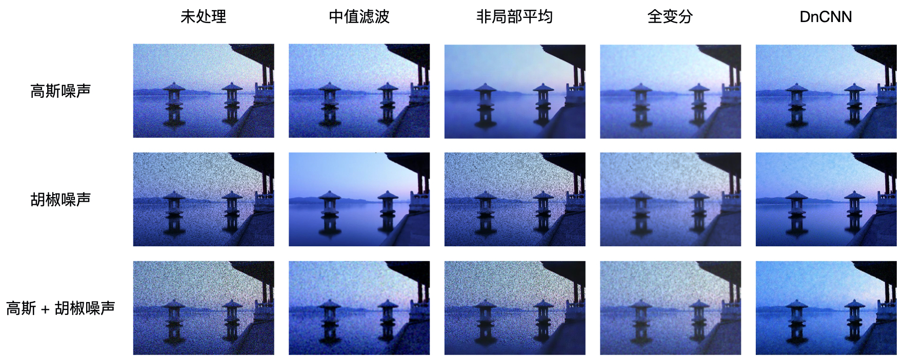
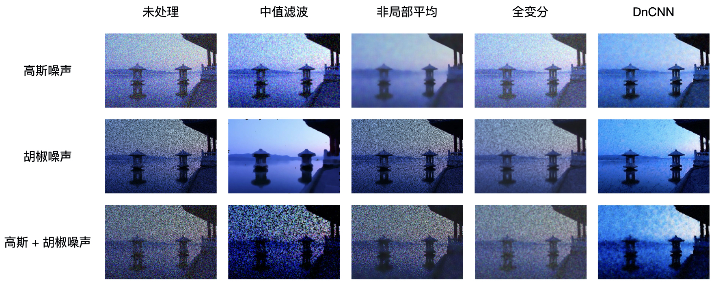

# 创建适用多噪声种类的图像去噪网络

## 摘要

在本项目中，我们使用卷积神经网络结构，训练了一个用于图像去噪的神经网络模型，并将模型的性能表现与一系列传统的图像去噪算法进行对比。根据结果，我们的模型在面对高斯噪声和椒盐噪声，以及二者混合的情况是都会拥有较好的性能表现。然而，对于噪声比例过大的情况，以及本项目测试数据中未知噪声种类的数据，我们的模型表现并不尽如人意。因此，在本项目的提交版本中，我们使用了传统的全方差模型进行彩色图片去噪。

## 神经网络模型

### 模型架构

在神经网络模型架构上，我们参考 "Beyond a Gaussian Denoiser: Residual Learning of Deep CNN for Image Denoising" 文中 DnCNN 模型的架构，将经过卷积层处理的图像作为“残差”，与输入的带有噪声的图片做差，从而得到去噪之后的图片。具体而言，在每个卷积块结构中，我们使用了 3x3 卷积 - 批归一化 - ReLU 激活函数的结构。在模型中，我们一共使用了 15 个此卷积块结构，其中每个卷积层的过滤器数量为 64。

> 我们也尝试了将模型的结构单元换成经典的 ResNet 模块，或者将图像的 DCT 变换后的值一并输入网络，但实验结果表明这些做法对网络的性能并没有明显提升。

### 模型训练

我们使用最小二乘误差作为模型的损失函数，在优化中使用 Adam 优化器，初始学习率为 $10^{-3}$，每 8 个 epoch 将学习率减半，共训练 32 个 epoch。我们使用了 COCO 数据集的一个交叉验证集用于模型训练，此数据集大约包括 5000 张图片，我们使用其中 10% 的图片作为交叉验证集合。在数据输入中，我们回为输入的图片以 0.7 为概率分别添加不同比例的高斯噪声和胡椒噪声，我们希望这些或大或小、有时不存在的噪声能够帮助神经网络学习如何正确的去噪。

## 传统算法

与图像分类、语义分割等领域不同，根据我们目前的了解，在图像去噪方面，神经网络模型并没有表现出相对于传统算法压倒性的优势。为了与我们训练的神经网络模型进行对比，同时为本项目准备 plan B，我们在训练神经网络模型的同时也在考虑添加的噪声种类的情况下尝试了几种传统算法，并将传统算法的结果与神经网路模型的结果做了横向的对比。

### 中值滤波

根据项目中对于添加噪声模块的要求，我们实现的部分为图像添加的是胡椒噪声，即图像中分散存在的纯黑斑点。对于椒盐噪声，在实际应用中最为普遍的降噪方法是中值滤波，即将每个像素的值用其一定邻域内的中值代替。通常来说，由于椒盐噪声中的纯黑 / 纯白都属于极端值，因此不容易被中值选中，可以起到滤波效果。如果 kernel size 选取得当，中值滤波能够极好的消除椒盐噪声，而如果选取的 kernel size 过大或过小，则可能造成图像模糊或者将小的椒盐噪声变成稀疏却较大的斑块。

### 非局部平均模型

传统的均值滤波器能够通过将每个像素的值替换为其邻域均值的方法消除高斯噪声，但由于对每个像素都进行了取均值操作，其也会造成图像模糊的问题。而非局部平均（NLM）方法在均值滤波的基础上进行了一些改进，此方法并不是对每个像素的邻域求均值，而是首先将图像划分为块，找出与每个块相似的其他块，再通过对这些相似的块加权平均的方法来求出原先的块经过滤波之后的结果。这可以在消除高斯噪声的同时显著降低图像因为取均值造成的模糊问题。

### 全变分模型

对图像的全变分（TV）模型去噪的实质是优化带有 L1 正则化项的最小二乘误差。对于二维的图片，以下公式定义了其最小二乘误差：
$$
E(x, y) = \frac{1}{2} \sum_{i, j} (x_{ij} - y_{ij})^2
$$
而二维的全变分以如下方式定义：
$$
V(y) = \sum_{ij} |y_{i + 1, j} - y_{ij}| + |y_{i, j + 1} - y_{ij}|
$$
最终，对于二维图像，全变分模型的优化目标是：
$$
\min_y (E(x, y) + \lambda V(y))
$$

> 事实上，我们也尝试了将空间域与变换域结合的 BM3D 去噪算法，此算法使用类似非局部平均的块匹配之后对由相似块叠加之后的三维张量进行变换后去噪并反变换，之后再使用出不去噪后的结果参与计算相似块并再次去噪。根据文献，此方法在传统算法中具有相对最好的性能表现。但是，此算法需要调整的超参数较多，并不满足我们希望将去噪过程完全自适应的需求，同时根据我们所见， Mo 平台没有包含支持 BM3D 的库，而此算法较高的复杂度使得其纯 Python 实现过于缓慢，因此我们没有在此项目中进一步探讨 BM3D 算法。

## 去噪算法横向对比

为了验证不同去噪算法在不同噪声情况下的性能表现，我们将这些算法进行了横向对比。我们选取了项目提供的测试图片作为基准图片，在噪声的选取上我们使用了（1）高斯噪声（2）胡椒噪声（3）高斯噪声混合胡椒噪声（4）预置的添加随机噪声的基准图片。对于算法的输出，我们比较了他们的 SSIM 相似度，并将结果进行了可视化以便于更为直观地查看去噪效果。

我们首先展示在已知噪声种类时，噪声比例为 0.2 的情况下各个算法的性能表现。

|                     |  中值滤波   | 非局部平均模型 | 全变分模型  |  DnCNN  |
| :-----------------: | :---------: | :------------: | :---------: | :-----: |
|    **高斯噪声**     |   0.45199   |  **0.83468**   |   0.75042   | 0.44327 |
|    **胡椒噪声**     | **0.90542** |    0.18307     |   0.61245   | 0.5445  |
| **高斯 + 胡椒噪声** |   0.30379   |    0.19764     | **0.48262** | 0.36887 |

我们首先展示在已知噪声种类时，噪声比例为 0.4 的情况下各个算法的性能表现。

|                     |  中值滤波   | 非局部平均模型 | 全变分模型  |  DnCNN  |
| :-----------------: | :---------: | :------------: | :---------: | :-----: |
|    **高斯噪声**     |   0.22814   |  **0.66311**   |   0.3547    | 0.3853  |
|    **胡椒噪声**     | **0.78137** |    0.13131     |   0.46874   | 0.42429 |
| **高斯 + 胡椒噪声** |   0.0467    |    0.11965     | **0.34605** | 0.19004 |

从以上的结果可以看出，在不同噪声种类的情况下，表现最好的算法各不相同：中值滤波适用于胡椒噪声，非局部平均在单纯的高斯噪声上具有最好的表现，而在胡椒噪声和高斯噪声混合时全变分模型可以达到相对好的性能。而 DnCNN 模型无论在何种情况下，都能达到看起来尚可的性能表现，但均无法达到最好。

> 值得注意的是，DnCNN 模型在优化时使用了最小二乘误差作为优化目标，但是此处我们比较的是 SSIM 相似度，而如果比较各个模型的最小二乘误差，DnCNN 会具有更好的得分。同时，从主观视觉观感上来看，我们认为 DnCNN 的去噪结果有时会好于 SSIM 误差最低的模型。

我们比较了不同算法对项目测试数据中未知种类噪声的去噪表现。遗憾的是，从结果来看，我们选取的所有算法都不能够有效的降低此类噪声。在项目的提交中，我们只能选取表现相对较好的全变分模型。

|              | 中值滤波 | 非局部平均模型 | 全变分模型 | DnCNN  |
| :----------: | :------: | :------------: | :--------: | :----: |
| **未知噪声** | 0.05377  |    0.23336     |  **0.39**  | 0.0634 |

## 结论与见解

经过本项目的实验结果，我们可以发现，打造一个面对多个类型噪声的、自适应的去噪模型并非易事。我们目前尝试的算法要么针对具体的噪声种类，要么能够对所有噪声混合的情形有效却效果并不好。因此，如何打造一个通用、自适应的去噪模型仍然是一个有趣的问题。

尽管实验中我们采用的 DnCNN 模型表现出来的去噪效果并不好，但我们依然认为，卷积神经网络会最有希望达到通用和自适应的标准的模型。未来的工作中，除了去发掘不同的模型架构，增大模型训练的数据集或使用预训练权重，以及在数据输入中添加更为多样化的噪声也是可以尝试的改进方法。

另外，我们虽然建立了包括最小二乘误差、余弦相似度、SSIM 相似度等指标来衡量去噪的效果，但从我们的实验上来看，这些指标并不总是正确反映了图像给人观感上的去噪效果。因此，如何建立一个更为符合人类审美的图片评价指标也会是一个有趣的问题。

